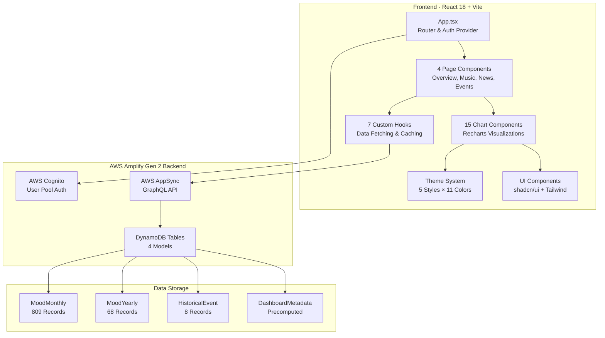
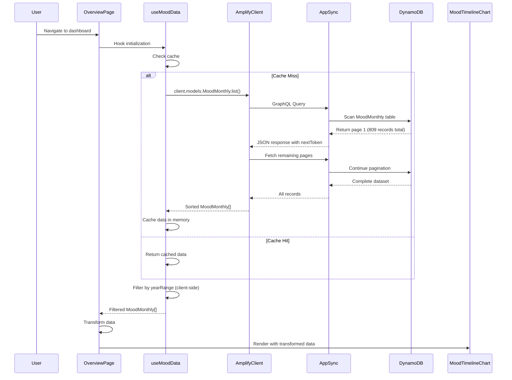

# Design Document

## Overview

Cultural Pulse is a read-only analytics dashboard built on AWS Amplify Gen 2, visualizing 67 years of cultural mood through integrated Billboard, Spotify, and HuffPost datasets. The system employs a serverless architecture with pre-seeded DynamoDB data, real-time GraphQL queries via AWS AppSync, and a React 18 frontend featuring 15 interactive chart components, 7 custom data hooks, and a comprehensive theme customization system. The dashboard provides temporal analysis capabilities spanning 1958-2025 with 809 monthly mood records, 68 yearly aggregates, and 8 major historical events with trajectory data.

## Architecture

### System Architecture



### Data Flow Sequence



## Technology Stack

| Category | Technology | Version | Purpose |
|----------|-----------|---------|---------|
| **Frontend** | | | |
| Framework | React | 18.2.0 | UI component library |
| Build Tool | Vite | 5.4.10 | Fast development server and bundling |
| Language | TypeScript | 5.4.5 | Type-safe development |
| Routing | React Router | 6.30.2 | Client-side navigation |
| UI Library | shadcn/ui | Latest | Pre-built accessible components |
| Styling | Tailwind CSS | 3.4.19 | Utility-first CSS framework |
| Charts | Recharts | 2.15.4 | Composable chart library |
| Icons | Lucide React | 0.561.0 | Icon components |
| Animation | Framer Motion | 12.23.26 | Smooth transitions |
| UI Primitives | Radix UI | Latest | Headless accessible components |
| **Backend** | | | |
| Backend Framework | AWS Amplify | 6.6.6 | Full-stack serverless platform |
| Backend SDK | @aws-amplify/backend | 1.5.0 | Infrastructure as code |
| Auth UI | @aws-amplify/ui-react | 6.5.5 | Cognito integration components |
| **AWS Services** | | | |
| Authentication | AWS Cognito | Gen 2 | User pool with email/password |
| API | AWS AppSync | Gen 2 | GraphQL API with real-time queries |
| Database | Amazon DynamoDB | Gen 2 | NoSQL data storage with secondary indexes |
| **Development** | | | |
| Linting | ESLint | Latest | Code quality enforcement |
| TypeScript ESLint | @typescript-eslint/* | Latest | TypeScript-specific linting |
| PostCSS | PostCSS | Latest | CSS processing |
| Autoprefixer | Autoprefixer | Latest | CSS vendor prefixing |

## Components

### Page Components (4)

- **OverviewPage.tsx** - Main dashboard with mood timeline, radial gauges, summary statistics, music/news comparison, and event impact analysis
- **MusicPage.tsx** - Spotify audio feature analysis with multi-line trends, energy-valence quadrant, tempo by decade, and artist diversity
- **NewsPage.tsx** - News sentiment and category analysis with stacked area chart, sentiment timeline, category pie chart, and volume trends
- **EventsPage.tsx** - Historical event comparisons with before/during/after charts, crisis recovery patterns, and mood heatmap with event markers

### Chart Components (15)

- **MoodTimelineChart.tsx** - Area chart displaying mood composite over time with historical event reference lines and interactive tooltips
- **MoodGauge.tsx** - Radial gauge component showing current mood values on 0-1 scale with color-coded indicators
- **MoodHeatmap.tsx** - Calendar heatmap (year × month) visualizing mood composite with color intensity and event markers
- **MusicNewsComparisonChart.tsx** - Dual-axis line chart comparing music mood and news sentiment trends
- **EventImpactChart.tsx** - Grouped bar chart showing baseline vs. event mood levels with percentage change indicators
- **AudioFeaturesChart.tsx** - Multi-line chart displaying Spotify audio features (valence, energy, danceability, tempo, etc.) over time
- **EnergyValenceQuadrant.tsx** - Scatter plot with four-quadrant layout categorizing mood by energy and valence dimensions
- **TempoTrendChart.tsx** - Bar chart showing average tempo (BPM) grouped by decade
- **ArtistDiversityChart.tsx** - Line chart tracking unique artist counts from Billboard data over time
- **NewsCategoryChart.tsx** - Stacked area chart showing distribution of six news categories with absolute/percentage toggle
- **NewsSentimentChart.tsx** - Line chart with standard deviation bands displaying news sentiment trends
- **NewsVolumeChart.tsx** - Bar chart showing monthly article counts across all categories
- **CategoryPieChart.tsx** - Donut chart displaying news category distribution for selected time period
- **BeforeDuringAfterChart.tsx** - Grouped bar comparison showing mood metrics in three equal-duration periods around selected event
- **CrisisRecoveryChart.tsx** - Multi-line chart comparing normalized mood recovery trajectories across all 8 historical events

### Custom Hooks (7)

- **useMoodData.ts** - Fetches and caches all 809 MoodMonthly records with automatic pagination, client-side year range filtering, and 5-minute cache TTL
- **useYearlyData.ts** - Fetches MoodYearly records with optional decade secondary index querying for efficient decade-level analysis
- **useHistoricalEvents.ts** - Fetches all 8 HistoricalEvent records with trajectory data for before/during/after analysis
- **useDashboardMetadata.ts** - Fetches precomputed DashboardMetadata including correlation matrices and summary statistics
- **useTheme.ts** - React context consumer providing access to current theme configuration state
- **useThemeConfig.ts** - Manages theme configuration persistence to localStorage with real-time CSS variable updates
- **use-mobile.ts** - Responsive design hook detecting mobile viewport breakpoints

### Layout Components

- **AppSidebar.tsx** - Navigation sidebar with four page links, user profile display, theme menu access, and sign-out functionality
- **ThemeMenu.tsx** - Theme customization panel with mode, style, color, base color, radius, and font pickers
- **YearRangeFilter.tsx** - Dual slider component allowing users to select start/end years (1958-2025) for data filtering
- **EventSelector.tsx** - Dropdown component for selecting one of 8 historical events for focused analysis
- **PeriodStatsCards.tsx** - Summary metric cards displaying latest mood values, top songs/artists, and trend indicators

### UI Components (shadcn/ui)

20+ components including: Button, Card, Sidebar, Select, Slider, Label, Separator, Skeleton, Dropdown Menu, Tooltip, and chart primitives

## Data Models

### MoodMonthly (809 records, 1958-2025)

```typescript
interface MoodMonthly {
  // Identity
  yearMonth: string;              // PK: "YYYY-MM" format
  year: number;                   // Secondary index key
  month: number;

  // Billboard metrics
  billboardEntries?: number;
  avgChartRank?: number;
  avgWeeksOnChart?: number;
  uniqueArtists?: number;
  topSongs?: string[];            // JSON array
  topArtists?: string[];          // JSON array

  // Spotify audio features (monthly means)
  spotifyValenceMean?: number;    // 0-1 happiness/positivity
  spotifyEnergyMean?: number;     // 0-1 intensity/activity
  spotifyDanceabilityMean?: number;
  spotifyAcousticnessMean?: number;
  spotifyInstrumentalnessMean?: number;
  spotifyLoudnessMean?: number;   // dB
  spotifyTempoMean?: number;      // BPM
  spotifySpeechinessMean?: number;
  spotifyPopularityMean?: number;
  spotifyTrackCount?: number;

  // Spotify audio features (standard deviations)
  spotifyValenceStd?: number;
  spotifyEnergyStd?: number;
  spotifyDanceabilityStd?: number;
  spotifyAcousticnessStd?: number;
  spotifyInstrumentalnessStd?: number;
  spotifyLoudnessStd?: number;
  spotifyTempoStd?: number;
  spotifySpeechinessStd?: number;
  spotifyPopularityStd?: number;

  // Spotify yearly fallbacks (for missing monthly data)
  spotifyYearlyValence?: number;
  spotifyYearlyEnergy?: number;
  spotifyYearlyDanceability?: number;
  spotifyYearlyAcousticness?: number;
  spotifyYearlyTempo?: number;
  spotifyYearlyPopularity?: number;

  // News metrics
  newsArticleCount?: number;
  newsSentimentMean?: number;     // -1 to +1 scale
  newsSentimentStd?: number;
  topNewsCategories?: Record<string, number>; // JSON: {"POLITICS": 100, ...}
  newsPoliticsCount?: number;
  newsEntertainmentCount?: number;
  newsComedyCount?: number;
  newsCrimeCount?: number;
  newsWorldNewsCount?: number;
  newsWellnessCount?: number;

  // Composite mood scores (0-1 scale)
  moodMusic?: number;             // Derived from Spotify valence/energy/danceability
  moodNews?: number;              // Derived from news sentiment (normalized to 0-1)
  moodComposite?: number;         // Combined music + news mood

  // Event marker
  historicalEvent?: string;       // Event code if month falls within event period
}
```

### MoodYearly (68 records, 1958-2025)

```typescript
interface MoodYearly {
  // Identity
  yearId: string;                 // PK: year as string
  year: number;
  decade: number;                 // Secondary index: 1950, 1960, etc.
  decadeLabel: string;            // "1950s", "1960s"

  // Billboard aggregates
  totalBillboardEntries?: number;
  avgUniqueArtistsMonthly?: number;
  avgWeeksOnChart?: number;

  // Mood aggregates
  avgMoodComposite?: number;
  avgMoodMusic?: number;
  avgMoodNews?: number;

  // Volume metrics
  totalNewsArticles?: number;
  totalSpotifyTracks?: number;

  // Event markers
  events?: string;                // Comma-separated event codes
}
```

### HistoricalEvent (8 major events)

```typescript
interface HistoricalEvent {
  // Identity and timeline
  eventCode: string;              // PK: e.g., "covid_pandemic_peak"
  eventLabel: string;             // e.g., "COVID-19 Pandemic"
  startDate: string;              // "YYYY-MM"
  endDate: string;                // "YYYY-MM"
  durationMonths?: number;

  // Mood metrics during event
  moodMusicAvg?: number;
  moodNewsAvg?: number;
  moodCompositeAvg?: number;
  moodMusicStd?: number;
  moodNewsStd?: number;
  moodCompositeStd?: number;

  // Baseline comparison
  vsBaselineMusic?: number;       // % change from baseline
  vsBaselineNews?: number;
  vsBaselineComposite?: number;

  // Trajectory data (before/during/after)
  trajectory?: {
    before: { avg: number; std: number };
    during: { avg: number; std: number };
    after: { avg: number; std: number };
  };
}
```

### DashboardMetadata (precomputed analytics)

```typescript
interface DashboardMetadata {
  metadataType: string;           // PK: "date_range", "correlation_matrix", "summary_stats"
  data: any;                      // JSON blob with precomputed data
  lastUpdated?: string;           // ISO timestamp
}
```

## Data Transformation Layer

### Key Transformation Functions (lib/data-transforms.ts)

```typescript
// Convert raw DynamoDB records to timeline format
transformForTimeline(data: MoodMonthly[]): TimelineDataPoint[]

// Create year × month matrix for heatmap visualization
transformForHeatmap(data: MoodMonthly[]): HeatmapData

// Aggregate monthly records to yearly summaries
aggregateToYearly(data: MoodMonthly[]): YearlyAggregate[]

// Filter by year range (client-side, no refetch)
filterByYearRange(data: MoodMonthly[], range: [number, number]): MoodMonthly[]

// Split data into before/during/after periods for event analysis
getEventPeriodData(data: MoodMonthly[], event: HistoricalEvent): EventPeriodData

// Extract latest period statistics for dashboard cards
getLatestPeriodStats(data: MoodMonthly[]): PeriodStats

// Calculate percentage change and trend direction
calculateChange(current: number, previous: number): { value: number; trend: "up" | "down" | "stable" }

// Format year-month for display (e.g., "Jan 1980")
formatYearMonth(yearMonth: string): string

// Get decade label (e.g., "1980s")
getDecadeLabel(decade: number): string
```

## Theme System Architecture

### Theme Configuration Types (lib/theme-config.ts)

```typescript
type ThemeMode = "light" | "dark"

type ThemeStyle = "vega" | "nova" | "mala" | "lyra" | "mira"

type ThemeColor =
  | "neutral" | "amber" | "blue" | "cyan" | "emerald" | "fuchsia"
  | "green" | "indigo" | "lime" | "orange" | "pink"

type BaseColor = "neutral" | "stone" | "zinc" | "gray"

type ThemeRadius = "none" | "small" | "medium" | "large"

type ThemeFont = "inter" | "noto-sans" | "nunito-sans" | "figtree"

interface ThemeConfig {
  mode: ThemeMode
  style: ThemeStyle
  themeColor: ThemeColor
  baseColor: BaseColor
  radius: ThemeRadius
  font: ThemeFont
}
```

### Style Characteristics

- **Vega**: Classic look. Clean, neutral, familiar design
- **Nova**: Reduced padding and margins for compact layouts
- **Mala**: Soft and rounded with generous spacing
- **Lyra**: Boxy and sharp. Pairs well with mono fonts
- **Mira**: Compact design made for dense interfaces

### Theme Implementation

- **theme-config.ts** (89 lines): Configuration types, defaults, and metadata
- **theme-colors.ts** (14,712 lines): Auto-generated color palettes for all combinations
- **theme-styles.ts** (587 lines): CSS variable definitions for 5 styles
- **ThemeProvider.tsx**: React context managing theme state with localStorage persistence
- **ThemeMenu.tsx**: UI component with 6 customization pickers

### Total Theme Combinations

5 styles × 11 colors × 4 base colors × 2 modes = **440 theme variations**

## Performance Optimizations

### 1. Client-Side Caching

**Implementation** (src/hooks/useMoodData.ts):
```typescript
// Module-level cache
let cachedData: MoodMonthly[] | null = null
let cachePromise: Promise<MoodMonthly[]> | null = null
```

- Fetches all 809 records once on initial load
- Stores in module-level JavaScript variable
- Subsequent page navigations reuse cached data
- No refetch unless explicitly requested via `refetch()`

### 2. Automatic Pagination Handling

- DynamoDB returns max 1000 items per request
- `useMoodData` automatically follows `nextToken` until all records fetched
- Transparent to consuming components

### 3. Client-Side Filtering

- Year range changes filter cached data in memory
- No GraphQL re-query needed
- Uses `useMemo` for efficient recomputation only when year range changes

### 4. Chart Data Sampling

- Timeline chart samples to 200 data points max for smooth rendering
- Heatmap uses CSS grid for efficient year × month matrix display

### 5. Code Splitting

- React Router lazy loading for 4 page components
- Reduces initial bundle size

### 6. React Optimization Hooks

- `useMemo` for expensive data transformations
- `useCallback` for stable function references
- `React.memo` on chart components to prevent unnecessary re-renders

## Security & Authorization

### Authentication Model

```typescript
// Amplify Data Schema Authorization
.authorization((allow) => [allow.authenticated().to(["read"])])
```

- All 4 models (MoodMonthly, MoodYearly, HistoricalEvent, DashboardMetadata) require authentication
- **Read-only access**: No create, update, or delete operations exposed
- AWS Cognito User Pool enforces email/password authentication
- JWT tokens validate API requests to AppSync

### Data Access Control

- **Shared Dataset**: All authenticated users see identical data
- **No User-Specific Data**: No per-user data isolation required
- **Pre-Seeded Data**: All records loaded via seed script, not user-generated

### API Security

- AppSync validates JWT tokens on every GraphQL request
- DynamoDB table permissions restricted to AppSync role
- No direct DynamoDB access from frontend

## Deployment Architecture

### Frontend Hosting

- Amplify Hosting with automatic CI/CD from Git
- Vite production build optimized with tree-shaking and minification
- CDN distribution for global low-latency access

### Backend Infrastructure

- CloudFormation stack managed by Amplify Gen 2
- Resources defined in `amplify/` directory as TypeScript code
- Automatic provisioning of Cognito, AppSync, DynamoDB

### Development Workflow

```bash
npx ampx sandbox           # Local cloud sandbox for development
npm run dev                # Start Vite dev server (localhost:5173)
npm run build              # Production build
npx ampx generate outputs  # Regenerate amplify_outputs.json
```
